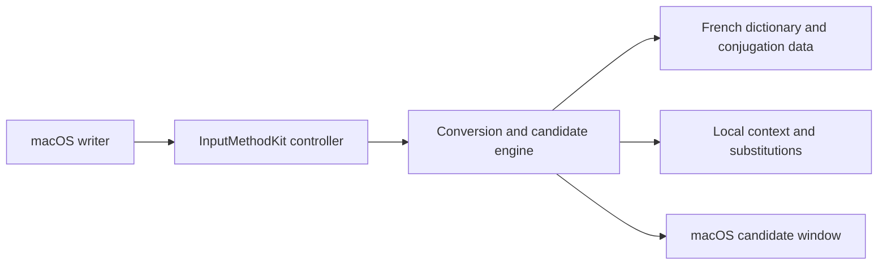

# Plume Française

A native, local-first macOS French input method that helps people write accurate French without sending typed text to a server.

## Overview

Plume Française is a desktop application designed to help French writers enter accented words, French punctuation, and common verb forms more naturally on macOS.

The project focuses on:

* Accent completion, spelling assistance, and French typographic punctuation
* Frequency- and context-aware candidate suggestions
* Local-only dictionaries, personal substitutions, and recent context
* Universal macOS support for Apple Silicon and Intel Macs

## Problem

Writing French quickly on a standard keyboard often requires repeated character switching for accents, apostrophes, and spacing before punctuation. Common missing accents and letter transpositions also interrupt writing flow.

Input methods process highly sensitive content. A French writing assistant should remain useful without uploading a person's typed text or context history to an external service.

Typical challenges include:

* Entering accented French words efficiently
* Applying French apostrophes and spacing conventions consistently
* Recovering from common accent omissions and spelling transpositions
* Preserving the privacy of typed text and learned context

## Solution

The system addresses these challenges by providing:

* Accent completion such as `ecole` → `école` and typographic apostrophes such as `jaime` → `j’aime`
* French spacing before `;`, `:`, `!`, and `?`, plus corrections for common typing errors
* Ranked suggestions using frequency, previous words, and subject-aware verb conjugation
* A local dictionary and local learning context with no server transmission

## Current Status

### Implemented

* Native macOS InputMethodKit application compatible with macOS 13.5+ on Apple Silicon and Intel
* Accent, apostrophe, punctuation, and common typo assistance
* 405 frequent verbs in present, passé composé, imparfait, and futur simple
* Local candidate ranking, local user substitutions, unit tests, formatting, and release build scripts

### In Progress

* Continued refinement of conversion and suggestion behavior through regression tests

### Planned

* Additional dictionary and conjugation coverage
* Further usability refinements based on real writing workflows

Planned capabilities are not included in the current release unless explicitly marked as implemented.

## Architecture



### Main Components

| Component | Responsibility |
| --- | --- |
| Input controller | Receives macOS input events and presents candidates |
| Conversion engine | Produces corrections, completions, and ranked suggestions |
| Dictionary data | Supplies French vocabulary and conjugation information |
| Local context | Stores personal substitutions and recent context on the Mac |
| Preferences interface | Provides user-facing configuration for the input method |

## Key Engineering Decisions

### Local-first text processing

**Decision:** Typed text, candidates, substitutions, and recent context remain on the user's Mac.

**Reason:** An input method handles sensitive content and should not depend on a remote service for ordinary writing assistance.

**Trade-off:** Dictionaries and language rules are packaged and updated with the application rather than learned from a cloud service.

### Native InputMethodKit implementation

**Decision:** The application uses macOS InputMethodKit and Objective-C++ rather than a browser-based or remote input solution.

**Reason:** Native integration is required to participate in macOS input-source selection and candidate handling.

**Trade-off:** The project is macOS-specific and requires Xcode/CocoaPods for source builds.

## Technology Stack

| Area | Technology |
| --- | --- |
| Language | Objective-C++ |
| Framework | macOS InputMethodKit, AppKit |
| Database | Local dictionary and preference data; no server database |
| Testing | Native unit-test scripts |
| Packaging | Universal macOS application, CocoaPods |
| CI/CD | Local formatting, test, and build scripts |

## Repository Structure

```text
.
├── src/                 # Input controller and conversion engine
├── dictionary/          # French dictionary and conjugation data
├── Tests/               # Native unit tests
├── docs/                # Screenshots and release documentation
├── package/             # Packaging scripts
├── PlumeFrancaise.xcworkspace
├── build.sh
└── README.md
```

## Getting Started

### Prerequisites

* macOS 13.5+
* Xcode and CocoaPods
* Git

### Installation

```bash
git clone https://github.com/JinyanShao/Plume-Francaise.git
cd Plume-Francaise
pod install
open PlumeFrancaise.xcworkspace
```

### Configuration

No credentials or environment file are required. After building, add the input method in **System Settings → Keyboard → Input Sources**.

### Run Locally

Build the `PlumeFrancaise` scheme in Release configuration from Xcode, or run:

```bash
bash build.sh
```

## Testing

Run the complete automated test suite:

```bash
sh unit-tests.sh
```

Run quality checks and a build:

```bash
sh format-code.sh
bash build.sh
```

## Example Workflow

1. A user enables Plume Française in macOS Input Sources.
2. The user types an unaccented word or the beginning of a French word.
3. The conversion engine creates and ranks local suggestions.
4. The user selects a candidate with a number key.
5. The selected French text is inserted without sending typed content to a server.

For example, `ecole` suggests `école`, and `nous` followed by `all` prioritizes `allons`.

## Reliability and Safety

The project includes the following reliability measures where applicable:

* Local-only processing of typed text and context
* Native unit tests and build verification scripts
* Explicit dictionary and licensing attribution
* Universal application support for Apple Silicon and Intel
* No committed credentials or network dependency for text processing

## Limitations

The current version does not yet include:

* Support for operating systems other than macOS
* Cloud synchronization of personal dictionary or context
* Coverage of every French verb, vocabulary item, or language variation

These limitations are documented intentionally to distinguish implemented functionality from future work.

## Roadmap

* [ ] Extend reviewed dictionary and conjugation coverage
* [ ] Add regression cases for real writing workflows
* [ ] Refine candidate ranking from local product feedback

## Documentation

Additional documentation is available in the repository:

* Installation guide
* Privacy policy
* Changelog and release notes
* Licensing and third-party attribution

## Licence

This project is licensed under GNU GPL v3.0. See `COPYING.md` and `LICENSE` for details. Conjugation data derived from Morphalou 3.1 retains its stated LGPL-LR licensing.

## Author

Jinyan Shao<br>
Software Engineer — Business Applications, Backend and Automation

* Website: [https://jinyanshao.ch](https://jinyanshao.ch/)
* GitHub: [https://github.com/JinyanShao](https://github.com/JinyanShao)
* LinkedIn: [https://www.linkedin.com/in/jinyanshao/](https://www.linkedin.com/in/jinyanshao/)
